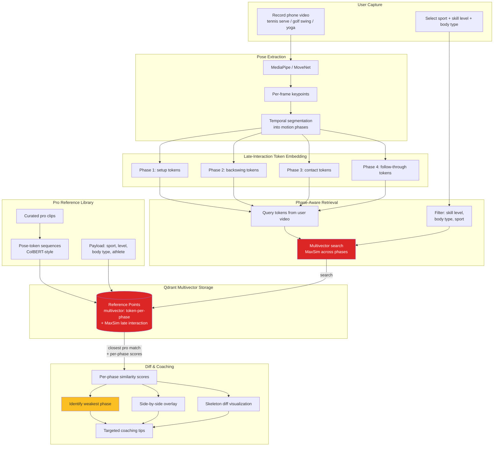

# MimicCoach — Self-Coaching by Pose-Embedding Lookup

A user records a phone video of themselves performing a tennis serve, skateboard trick, golf swing, or yoga pose. The app extracts a pose-sequence embedding (MediaPipe/MoveNet → temporal aggregation), queries Qdrant against a curated library of professional reference clips, and overlays a side-by-side diff with the closest pro match — filtered by user-chosen skill level, body type, or sport. The novelty is using Qdrant's late-interaction/multivector storage for time-sliced pose tokens (similar to how ColBERT/ColPali use it for documents) so that retrieval is sensitive to which phase of the motion is off, not just an averaged whole-sequence embedding. No public Qdrant demo currently does pose-based motion retrieval.

## Architecture

## Qdrant Features Showcased

- **Late-interaction multivector storage** — ColBERT/ColPali-style token-per-phase embeddings instead of a single averaged vector
- **MaxSim scoring** — per-phase similarity makes retrieval sensitive to *which* part of the motion diverges
- **Payload filtering** — skill level, body type, and sport narrow the reference pool before similarity ranking
