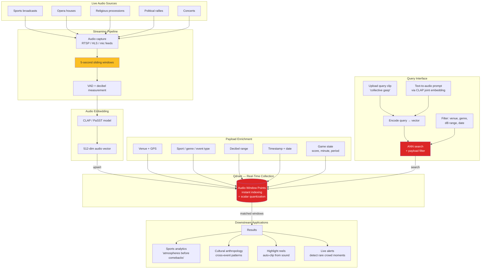

# Stadium Pulse — Real-Time Search of Crowd & Cultural Soundscapes

A streaming pipeline that ingests live audio from sports broadcasts, opera houses, religious processions, political rallies, and concerts, segments it into ~5-second windows, encodes each with a CLAP or PaSST audio model, and upserts vectors into Qdrant in real time. A user can submit a query clip ("a 90,000-person collective gasp," "a slow-build standing ovation," "a single voice silencing a stadium," "the second between a free-kick whistle and a goal") and get cross-event matches. Filters by venue, sport/genre, decibel range, and date make it both a sports analytics tool (which atmospheres precede comebacks?) and a cultural-anthropology tool. This idea uniquely showcases Qdrant's instant indexing ("vectors are searchable the moment they're added"), quantization for low-RAM long-tail audio storage, and the rare combination of streaming ingestion + ANN search that very few open demos exhibit.

## Architecture

## Qdrant Features Showcased

- **Instant indexing** — vectors are searchable the moment they are upserted from the live stream, no batch reindex
- **Scalar / product quantization** — keeps RAM low across a long-tail archive of millions of audio windows
- **Streaming ingestion + ANN search** — sustained upsert + query throughput on the same collection, a rare combination in public demos
- **Payload-indexed filtering** — venue, genre, decibel range, date, and game state queried alongside the vector
- **Multimodal CLAP queries** — joint text-and-audio embedding lets users search by natural-language prompt or by example clip
