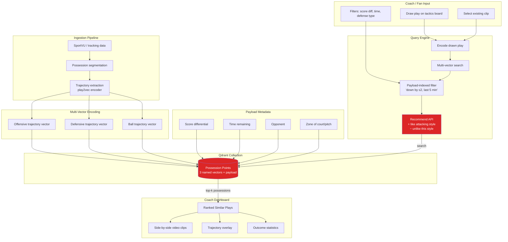

# TacticalTwin — Play Trajectory Retrieval for Coaches and Fans

Index basketball, football, or hockey possessions as multi-vector points: one vector for the offensive player trajectory, one for the defensive trajectory, one for the ball, plus a payload of game state (score differential, time remaining, opponent, zone of court/pitch). A coach draws a play on a tactics board (or selects an existing clip), and Qdrant returns the most similar real possessions filtered by "down by ≤2 in the last 5 minutes" or "vs. zone defense." This operationalizes the play2vec / SportVU research that has lived only in Sloan Conference papers and turns it into an interactive demo. Showcases multivector queries, payload-indexed filtering, and the Recommend API (positive/negative examples = "make it more like this attacking style, less like that one").

## Architecture

## Qdrant Features Showcased

- **Named multi-vector points** — separate vectors for offense, defense, and ball trajectories on a single point
- **Payload-indexed filtering** — game-state filters (score diff, time, opponent, zone) executed alongside vector search
- **Recommend API** — positive/negative examples to steer search toward an attacking style or away from another
